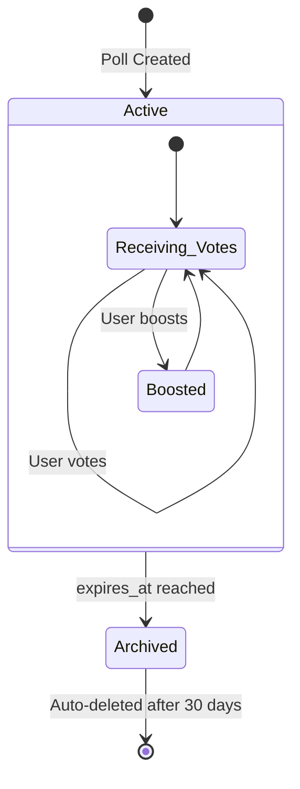

# Business Logic Rules & Constraints

## Poll Management Rules

### Poll Creation
- **Authentication Required**: Only authenticated users can create polls
- **Input Validation**: 
  - Question: 10-200 characters, XSS protection
  - Options: 2-10 options, 1-100 characters each
  - Duration: 1 hour to 7 days
- **Rate Limiting**: Maximum 5 polls per hour per user
- **Default Settings**: 24-hour expiration, active status

### Poll Lifecycle


### Poll Voting Rules
- **One Vote Per User**: Enforced by unique constraint (user_id, poll_id)
- **Vote Editing**: Users can change their vote before poll expires
- **Hold Mechanism**: 3-second minimum hold to prevent accidental votes
- **Authentication**: Login required for voting
- **Rate Limiting**: 20 votes per minute per user

## Button Hold System Rules

### Session Management
- **Anonymous Allowed**: Button can be pressed without login
- **Device Tracking**: Unique device fingerprint for anonymous users
- **Geographic Data**: Country detection for statistics
- **Session Timeout**: 15 seconds of inactivity ends session
- **Heartbeat**: Required every 3 seconds to maintain session

### Hold Duration Logic
```javascript
// Minimum hold requirements
const MINIMUM_HOLD_TIME = 3000; // 3 seconds
const HEARTBEAT_INTERVAL = 3000; // 3 seconds
const SESSION_TIMEOUT = 15000; // 15 seconds
```

## Boost System Rules

### Daily Limits
- **Limit Per User**: 3 boosts per day per user
- **Reset Time**: Midnight UTC
- **Authentication Required**: Must be logged in to boost
- **Rate Limiting**: Tracked in daily_boost_limits table
- **Boost Effect**: Increases poll visibility in "hot" sorting

### Boost Calculation
```javascript
// Hot score formula
hotScore = (totalVotes + (boostCount * 3)) * timeFactor
timeFactor = Math.max(0.1, 1 / (1 + ageInHours * 0.1))
```

## Social Features Rules

### Following System
- **Self-Follow Prevention**: Users cannot follow themselves
- **Mutual Follows**: Bidirectional relationships allowed
- **Follow Limits**: No technical limit (consider implementing)
- **Privacy**: All follow relationships are public

### Badge System
- **Automatic Award**: Badges earned based on achievement criteria
- **Criteria Types**: votes_cast, polls_created, boosts_received, etc.
- **No Revocation**: Badges are permanent once earned
- **Public Display**: All earned badges visible to other users

## Security & Privacy Rules

### Data Access Control
- **RLS Enforcement**: Row Level Security on all tables
- **User Data Isolation**: Users can only access their own private data
- **Public Data**: Active polls, poll results, and profiles are public
- **Hidden Content**: Users can hide polls from their personal feed

### Content Moderation
- **Input Sanitization**: All user input sanitized for XSS prevention
- **Content Validation**: Server-side validation for all inputs
- **Spam Prevention**: Rate limiting on all user actions
- **Profanity Filter**: Consider implementing (not currently active)

## Caching & Performance Rules

### Vote Count Caching
```sql
-- Triggers maintain cache consistency
UPDATE poll_options SET votes_cache = (actual_count)
UPDATE polls SET total_votes_cache = (sum_of_option_votes)
```

### Real-time Updates
- **Immediate Updates**: Vote changes broadcast immediately
- **Batch Processing**: Statistics updated in batches
- **Heartbeat Efficiency**: Only active sessions receive updates

## Data Retention Rules

### Automatic Cleanup
- **Expired Polls**: Moved to archived status automatically
- **Old Archives**: Deleted after 30 days (consider implementing)
- **Inactive Sessions**: Cleaned up after 15 seconds
- **Old Vote Holds**: Cleaned up immediately after completion

### User Data Management
- **Account Deletion**: Cascade delete from profiles
- **Data Export**: Consider implementing for GDPR compliance
- **Anonymization**: Consider for deleted accounts