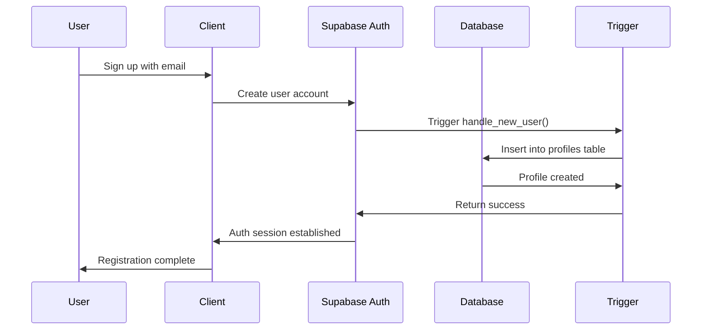
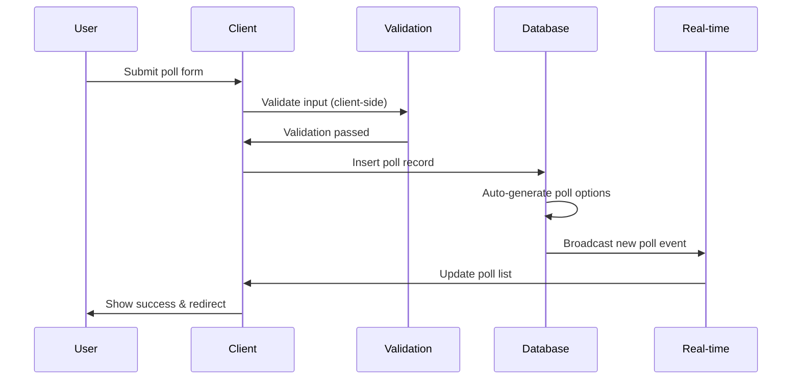
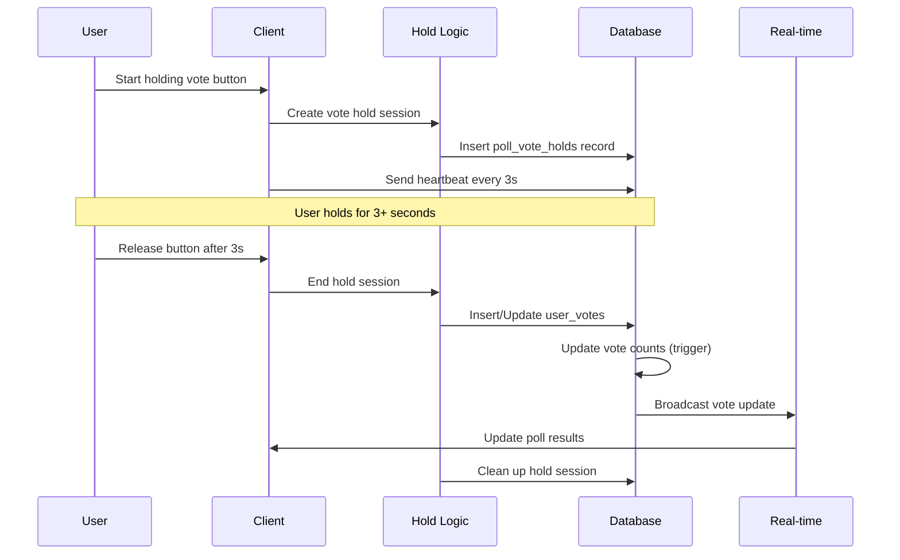
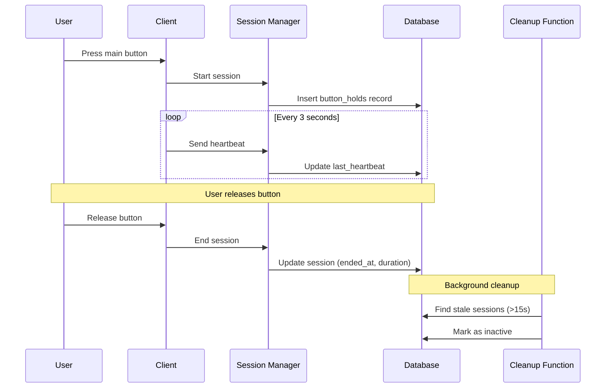
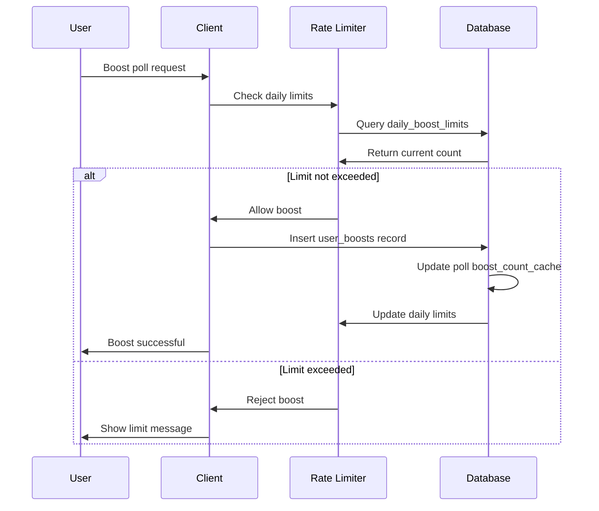
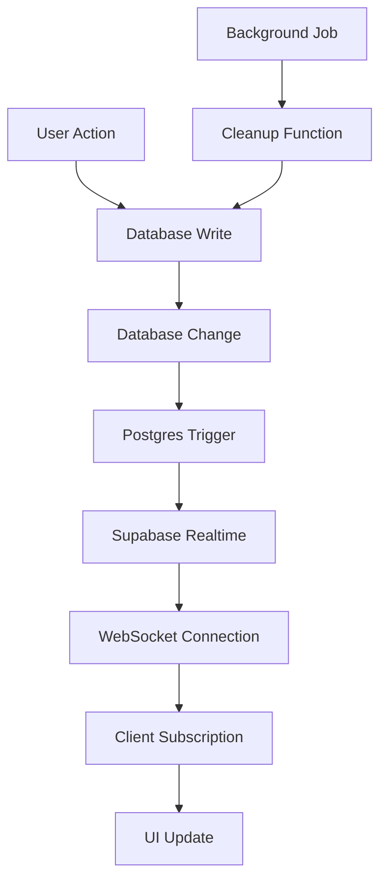
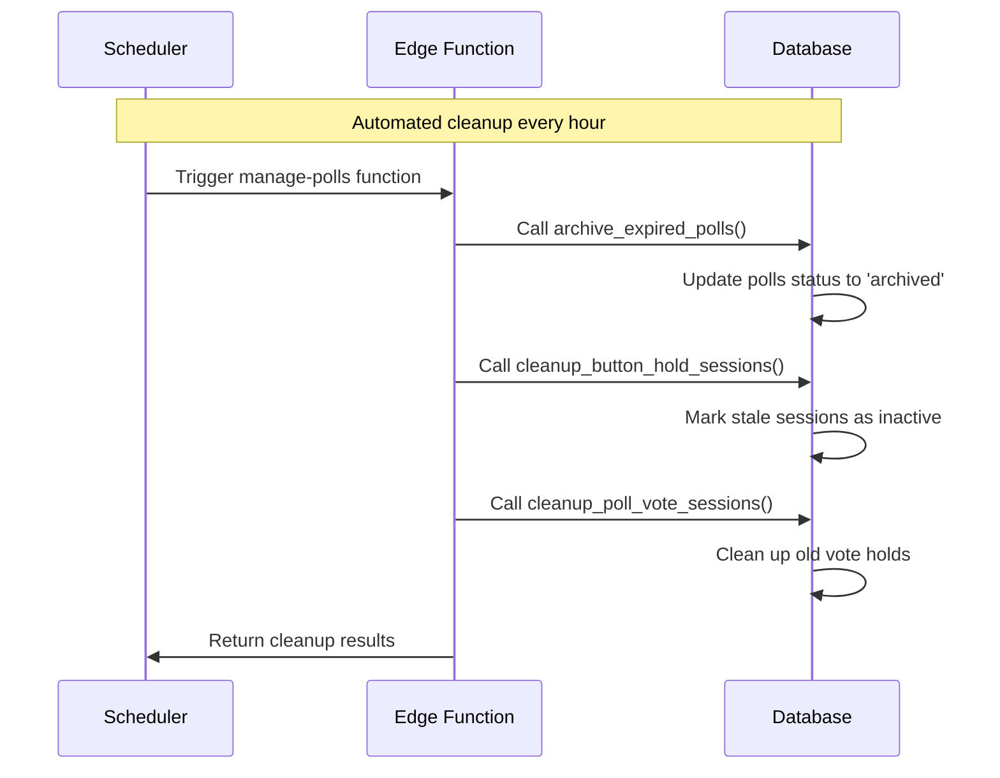

# Data Flow Workflows

## User Registration & Authentication

## Poll Creation Workflow

## Voting Process

## Button Hold Session Management

## Poll Boost System

## Real-time Data Synchronization

## Archive and Cleanup Processes

