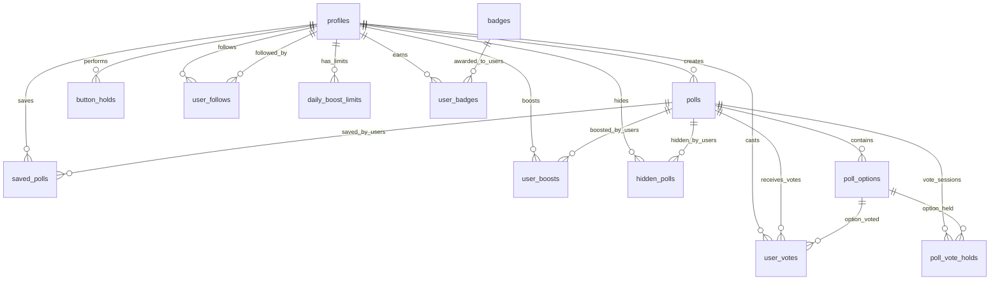

# Database Architecture Overview

## Core Entity Relationships



## Table Hierarchy & Dependencies

### Primary Tables
- **profiles**: User information (auth.users foreign key)
- **polls**: Poll questions and metadata
- **poll_options**: Multiple choice options for polls

### Activity Tables
- **user_votes**: Voting records (links users to poll options)
- **button_holds**: Real-time button press sessions
- **user_boosts**: Poll promotion actions
- **saved_polls**: User bookmarks
- **hidden_polls**: User content filtering

### System Tables
- **daily_boost_limits**: Rate limiting for boosts
- **poll_vote_holds**: Real-time vote hold sessions
- **user_follows**: Social relationships
- **badges**: Achievement definitions
- **user_badges**: User achievements

## Data Flow Patterns

### Write Operations Flow
```
User Action → Input Validation → RLS Check → Database Write → Cache Update → Real-time Broadcast
```

### Read Operations Flow
```
Request → RLS Filter → Cache Check → Database Query → Response Transform → Client Update
```

## Critical Constraints

### Referential Integrity
- All user_id fields reference profiles.id (not auth.users directly)
- Poll options must belong to existing polls
- Votes must reference valid poll options
- Boosts respect daily limits

### Business Rules
- One vote per user per poll (enforced by unique constraint)
- Polls expire automatically (status change trigger)
- Button sessions timeout after 15 seconds of inactivity
- Boost limits reset daily (3 boosts per user per day)

### Security Boundaries
- RLS enabled on all tables
- Users can only modify their own data
- Poll creators can manage their poll options
- Public read access for active polls only