# ButtonApp

Status: In Progress
Owner: AFK Studio
Completion: 0
Description: Wprowadzenie:
Ten dokument stanowi rozszerzoną wersję dokumentacji aplikacji Push It!.  Oparty jest na pierwotnym materiale wygenerowanym w narzędziu Lovable i został uzupełniony o najnowsze zmiany w projekcie.  Kluczowym dodatkiem jest nowy mechanizm głosowania poprzez przytrzymanie przycisku – ankiety w aplikacji korzystają teraz z tej samej logiki co globalny przycisk „Push It!”, dzięki czemu użytkownicy zawsze widzą, ile osób w danym momencie wspólnie trzyma przycisk (zarówno w sekcji The Button, jak i w ankietach).  Dokumentacja zachowuje układ i kolejność sekcji oryginału, aby łatwo można było śledzić rozwój funkcji.
Priority: High
🪬 Stack: Notion (https://www.notion.so/Notion-1dc35605529c8073b23ce224e7fbdbcb?pvs=21), Cursor (https://www.notion.so/Cursor-1dc35605529c80be9f85c1e729d728ae?pvs=21), Supabase (https://www.notion.so/Supabase-1df35605529c806187c5ce8a5946360a?pvs=21), GitHub (https://www.notion.so/GitHub-1f935605529c80b4b8c1cf7bbdb4c54a?pvs=21), Lovable (https://www.notion.so/Lovable-1df35605529c80cbb1fbf84d8a9f1b55?pvs=21), Chatgpt (https://www.notion.so/Chatgpt-1dc35605529c80d7a717c8bafb6daa5c?pvs=21)

# Opis ogólny aplikacji

**Push It!** to interaktywna platforma ankietowa działająca w czasie rzeczywistym. Umożliwia tworzenie i udział w krótkich, społecznościowych głosowaniach. Idealna do szybkiego zbierania opinii lub zabawy w ankiety.

### Dla kogo?

Aplikacja jest skierowana do:

- **Twórców ankiet** – osób, które chcą zadać pytanie społeczności,
- **Głosujących** – użytkowników oddających głosy i śledzących wyniki.

### Główne funkcje:

- **Tworzenie i udział w ankietach** – każdy zarejestrowany użytkownik może tworzyć ankiety i głosować.
- **Wyniki na żywo** – liczba głosów aktualizuje się automatycznie, bez odświeżania strony.
- **System boostowania ankiet** – użytkownicy mogą promować ankiety, zwiększając ich zasięg (dawniej: system "push").
- **Grywalizacja** – odznaki i statystyki dla najbardziej aktywnych użytkowników.

### Potencjał viralowy – siła przycisku „Push It!”

Jednym z kluczowych elementów viralowego potencjału aplikacji jest globalny przycisk **„Push It!”** – prosty, ale niezwykle angażujący mechanizm. Użytkownik przytrzymując przycisk, widzi w czasie rzeczywistym, ilu innych ludzi na świecie robi to samo. Ten pozornie niewinny gest uruchamia silny **efekt FOMO (fear of missing out)** – użytkownicy nie chcą „przegapić momentu”, kiedy wszyscy są aktywni jednocześnie.

To działa, bo:

- **Tworzy wspólne doświadczenie** – użytkownicy czują, że uczestniczą w czymś większym niż tylko kliknięcie.
- **Budzi ciekawość i uzależnia** – „czy ktoś trzyma przycisk teraz?”, „ile osób było dziś aktywnych?”.
- **Zachęca do powrotów i dzielenia się** – użytkownicy chcą pokazać znajomym momenty z największą aktywnością.
- **Naturalny impuls do udostępniania** – zrzuty ekranu i statystyki z przycisku świetnie sprawdzają się w social media.

Ten mechanizm łączy prostotę z emocją, co czyni go doskonałym zapalnikiem do wirusowego rozprzestrzeniania się aplikacji.

### Technologia

Aplikacja jest obecnie w fazie **MVP** (Minimum Viable Product) i została zbudowana z wykorzystaniem nowoczesnych technologii:

- **Frontend**: React + TypeScript
- **Backend**: Supabase (PostgreSQL, autentykacja, funkcje czasu rzeczywistego)

Dzięki temu wszystkie działania – tworzenie ankiet, głosowanie, aktualizacja statystyk – są synchronizowane w czasie rzeczywistym.

### Dokumentacja

Obejmuje zarówno obecne funkcje aplikacji, jak i planowane rozszerzenia (roadmapę) na kolejne etapy rozwoju.

# Workflow użytkownika

## Główne ścieżki użytkownika

W aplikacji **Push It!** dostępne są cztery kluczowe ścieżki użytkownika:

1. **Głosowanie w ankietach**
2. **Tworzenie własnych ankiet**
3. **Boostowanie (promowanie) ankiet**
4. **Przytrzymywanie globalnego przycisku „Push It!”** – dla zabawy i efektu FOMO

Poniżej opisane są szczegółowo wszystkie scenariusze.

---

### 🗳 Głosowanie w ankiecie

Po zalogowaniu użytkownik trafia do głównego feedu ankiet i wybiera interesującą go ankietę. Wyświetlane są pytanie i dostępne opcje odpowiedzi. Aby zagłosować:

1. **Kliknij i przytrzymaj wybraną opcję.**
2. **Odliczanie (3, 2, 1)** – pojawia się animowany ekran, który informuje, że głos zostanie oddany po 3 sekundach ciągłego trzymania przycisku.
3. **Wspólne trzymanie** – po odliczaniu użytkownik widzi, **ile osób w tym samym momencie również trzyma przycisk** (zarówno w ankietach, jak i globalny przycisk „Push It!”).
4. **Zwolnienie = głos** – puszczenie przycisku po 3 sekundach rejestruje głos. Zwolnienie wcześniej anuluje całą akcję.

### Dodatkowe funkcje:

- **Wyniki widoczne dopiero po głosie** – aby nie wpływać na niezdecydowanych.
- **Jednorazowa korekta** – użytkownik może poprawić swój głos tylko raz, potem zmiana nie jest możliwa.
- **Gość (tryb read-only)** – niezalogowani mogą przeglądać ankiety, ale nie mogą głosować ani tworzyć ankiet.
- **Zapis i ukrycie ankiet** – ankiety można dodać do ulubionych lub ukryć, aby dopasować feed.

System głosowania bazuje na **mechanizmie heartbeat/cleanup**, który usuwa nieaktywne sesje (np. w przypadku utraty połączenia), aby zapobiec tzw. *ghost sessions*.

---

### ✍️ Tworzenie ankiety

Każdy zalogowany użytkownik może utworzyć ankietę:

1. Wejdź w **sekcję Create** (ikona „+” w dolnym menu).
2. Wypełnij formularz: pytanie, co najmniej 2 odpowiedzi oraz opcję **„Pokaż nazwę twórcy”** (anonimowość zależy od ustawienia).
3. Zatwierdź formularz – ankieta natychmiast trafia do feedu jako aktywna.

### Zasady:

- **Czas trwania** – każda ankieta jest aktywna przez 24 godziny.
- **Brak edycji po publikacji** – pytanie i odpowiedzi są niezmienialne, aby zachować integralność głosowania.
- **Twórca nie może głosować we własnej ankiecie** – od razu widzi wyniki (0% na starcie), ale nie może oddać głosu.
- **Wyniki aktualizują się w czasie rzeczywistym** – twórca i inni użytkownicy widzą postępy na żywo.

---

### 🚀 Boostowanie (promowanie) ankiety

Boostowanie pozwala użytkownikom zwiększać zasięg ankiet i wpływać na ich pozycję w sekcji **Hot**.

- Każdy użytkownik ma **3 boosty dziennie** (limit odnawia się o północy UTC, niewykorzystane boosty przepadają).
- Boost można wykorzystać zarówno na **cudzą**, jak i **własną ankietę**.

W interfejsie odbywa się to przyciskiem (np. ikona rakiety). Po użyciu:

- pojawia się komunikat („Poll pushed! 🚀”),
- licznik boostów zmniejsza się o 1,
- `push_count` ankiety rośnie, a jej pozycja w sekcji Hot wzrasta.

Boostowanie jest ograniczone dziennym limitem, by zapobiec spamowaniu.

---

### 🌍 Globalny przycisk „Push It!”

Globalny przycisk **„Push It!”** to funkcja społecznościowa i zabawowa.

- Można go nacisnąć i **przytrzymać w dowolnym momencie**, niezależnie od ankiet.
- W czasie trzymania przycisku użytkownik widzi **ile osób na całym świecie robi to samo w tym samym momencie**.
- Funkcja działa jak **społeczny gadżet** – nie ma celu użytkowego, ale budzi ciekawość, generuje **efekt FOMO** i zachęca do powrotów.
- Aby skorzystać z funkcji należy być zalogowanym

Przycisk ten korzysta z tego samego systemu heartbeat/cleanup, co głosowanie w ankietach, co zapewnia aktualne dane w czasie rzeczywistym.

# Opis ekranów aplikacji

Aplikacja mobilna **Push It!** składa się z pięciu głównych ekranów, dostępnych w stałym dolnym menu:

- **The Button**
- **Vote**
- **Create**
- **Stats**
- **My App**

Poniżej szczegółowy opis funkcji każdego z tych ekranów:

Do zmiany!!!

```mermaid
graph TD
  %% Główne ekrany
  A[button_page]
  B[feed_page]
  C[create_page]
  D[statistics_page]
  E[myapp_page]

  %% Feed tabs
  B --> B1[feed_live_tab]
  B1 --> B1a[polview_modal]
  B --> B2[feed_archive_tab]

  %% Statistics tabs
  D --> D1[statistics_daily_tab]
  D --> D2[statistics_monthly_tab]
  D --> D3[statistics_hot_tab]

  %% MyApp tabs
  E --> E1[mypolls_tab]
  E1 --> E1a[mypolls_created_subtab]
  E1 --> E1b[mypolls_voted_subtab]
  E1 --> E1c[mypolls_saved_subtab]

  E --> E2[community_tab]

  E --> E3[profile_tab]
  E3 --> E3a[profile_account_subtab]
  E3 --> E3b[profile_settings_subtab]

  %% System views
  F[system_views]

  F --> F1[modals]
  F1 --> F1a[polview_modal]
  F1 --> F1b[profile_modal]

  F --> F2[real_time]
  F2 --> F2a[countdown_overlay]
  F2 --> F2b[counter_overlay]

  F --> F3[successes]
  F3 --> F3a[polladd_success]
  F3 --> F3b[vote_success]

  F --> F4[errors]
  F4 --> F4a[polladd_error]

```



[AppViews](AppViews%2024035605529c8068a7dfd0479bda577c.csv)

## 1. The Button (globalny przycisk)

**Cel:** Społecznościowa zabawa niezwiązana bezpośrednio z ankietami.

**Interakcja:**

- Po wybraniu tej sekcji użytkownik widzi pomarańczowy przycisk **„Push It!”** i instrukcję:
    
    „Przytrzymaj przycisk przez 3 sekundy, aby zobaczyć, ile osób na świecie robi to samo co Ty.”
    
- Po przytrzymaniu przycisku aplikacja inicjuje sesję i korzystając z mechanizmu **heartbeat** okresowo synchronizuje informacje o aktywnych użytkownikach.
- Po 3 sekundach użytkownik otrzymuje komunikat, np.:
    
    > „X osób na świecie trzyma przycisk jednocześnie!”
    > 
- Użytkownik może kontynuować trzymanie przycisku, liczba osób aktualizuje się w czasie rzeczywistym.

**Dane z sesji:**

- Służą wyłącznie celom statystycznym i zabawowym.
- Zasilają dzienne zestawienia i rekordy w sekcji **Stats**.

**Uwagi techniczne:**

- Dokładna częstotliwość heartbeat jest definiowana przez zespół developerski i nie jest ustalana w dokumentacji.

**Inspiracja:** Eksperymenty społecznościowe (np. redditowe „The Button”).

---

## 2. Vote (feed ankiet)

**Cel:** Przeglądanie i udział w ankietach społeczności.

### 2.1. Widok główny

- Lista **aktywnych** ankiet.
- Filtry/sortowanie:
    - **Hot** – trendujące (najwięcej boostów)
    - **Popular** – najwięcej głosów
    - **New** – najnowsze
- Przełącznik **Live / Archive**:
    - **Live** – ankiety w trakcie głosowania
    - **Archive** – zakończone ankiety (wyniki tylko do wglądu)

### 2.2. Karta ankiety

- **Pytanie**
- **Opcje odpowiedzi** (procentowo lub liczbowo, w zależności od stanu głosowania)
- **Autor** (jeśli wybrano opcję publikacji nazwy)
- **Statystyki aktywności:** liczba głosów, liczba boostów
- **Statusy:**
    - „Voted” – jeśli użytkownik już głosował
    - „Pushed” – jeśli użytkownik zboostował

### 2.3. Głosowanie

- Kliknięcie i przytrzymanie wybranej opcji przez 3 sekundy (jak przycisk **Push It!**).
- W trakcie odliczania pokazuje się liczba osób głosujących lub trzymających globalny przycisk.
- Zwolnienie przycisku po odliczeniu – rejestruje głos; zwolnienie wcześniej – anuluje.
- **Edycja głosu:** jednorazowa, po zmianie dalsze poprawki są zablokowane.

### 2.4. Dodatkowe akcje na karcie

- **Boost** (ikona rakiety) – promowanie ankiety
- **Save** (ikona gwiazdki) – dodanie do ulubionych
- **Hide** (ikona przekreślonego oka) – ukrycie ankiety z feedu

---

## 3. Create (tworzenie ankiety)

**Dostęp:** Ikona **„+”** w dolnym menu.

### 3.1. Formularz (modal)

- **Pytanie** – krótka, jasna treść ankiety
- **Opcje odpowiedzi** – min. 2 pola, możliwość dodawania kolejnych
- **Widoczność autora** – przełącznik anonimowości (pokazanie/ukrycie nazwy)

### 3.2. Publikacja

- Po zatwierdzeniu ankieta:
    - zostaje opublikowana i jest aktywna przez **24 godziny**,
    - pojawia się w zakładce **New**,
    - po boostowaniu również w **Hot**.
- Twórca **nie może głosować** we własnej ankiecie (widzi tylko wyniki).
- Brak możliwości edycji pytania lub opcji po publikacji.
- Po publikacji modal zamyka się, użytkownik pozostaje w feedzie.

---

## 4. Stats (statystyki społeczności)

**Cel:** Podsumowanie globalnej aktywności.

### 4.1. Kluczowe wskaźniki

- **Community Members** – liczba zarejestrowanych użytkowników
- **Total Polls** – liczba wszystkich ankiet
- **Total Votes** – suma głosów oddanych we wszystkich ankietach
- **Button Presses (24h)** – wciśnięcia globalnego przycisku z ostatniej doby
- **Max Simultaneous (24h)** – maks. jednoczesne trzymania przycisku w ostatnich 24h
- **All-Time Record** – najwyższy historyczny wynik wspólnego trzymania

### 4.2. Planowane rozszerzenia

- **Daily Stats** – szczegółowe zestawienia dzienne
- **Monthly Stats** – miesięczne podsumowania
- **Hall of Fame** – rekordowe ankiety i użytkownicy
- **Top Countries** – kraje z największą aktywnością

---

## 5. My App (konto i społeczność)

Ekran dzieli się na trzy podzakładki, które umożliwiają zarządzanie ankietami i interakcję z innymi użytkownikami.

### 5.1. My Polls (Moje ankiety)

- **Created**
    - Lista ankiet utworzonych przez użytkownika
    - Oznaczenie aktywnych (np. zielona kropka) oraz czas do zakończenia (np. „23h”)
    - Link do **Archive** (zakończone ankiety z końcowymi wynikami)
- **Voted**
    - Ankiety, w których użytkownik oddał głos
    - Możliwość sprawdzenia ostatecznych wyników
- **Saved**
    - Ankiety oznaczone jako ulubione
    - Prywatna lista do późniejszego powrotu

### 5.2. Community (Społeczność)

- **Statystyki użytkownika:**
    - Followers, Following
    - Votes received, Boosts received
- **Lista obserwowanych i obserwujących:**
    - Każda pozycja wyświetla nazwę użytkownika
    - Kliknięcie otwiera modal profilu z aktywnymi ankietami i statystykami
- **Wyszukiwanie i follow/unfollow:**
    - Wyszukiwarka przeszukuje profile po nazwie
    - Kliknięcie „Follow” lub „Unfollow” aktualizuje relację

### 5.3. Profile (Profil)

- **Dane konta:** email, nazwa użytkownika
- **Statystyki osobiste:** liczba utworzonych ankiet i otrzymanych głosów
- **Your Badges:** lista zdobytych odznak (opis i data zdobycia)
- **Ustawienia:**
    - Wylogowanie (Sign Out)
    - Zmiana hasła i inne opcje konta

# Struktura danych aplikacji

# Schemat bazy danych

Aplikacja **Push It!** wykorzystuje relacyjną bazę PostgreSQL (Supabase) do przechowywania wszystkich danych związanych z użytkownikami, ankietami i aktywnościami. Poniżej znajduje się szczegółowy opis kluczowych tabel, ich pól oraz wzajemnych relacji w formie opisowej.

---

## profiles (użytkownicy)

Tabela **profiles** przechowuje dane o kontach użytkowników aplikacji. Każdy rekord posiada unikalne `id`, `username`, `email`, `country` oraz `created_at`, wskazujące datę założenia konta. Jest to główna tabela odniesienia – w innych tabelach występują klucze obce wskazujące na profile, np. twórcę ankiety, głosującego użytkownika czy autora sesji przycisku.

**Relacje:**

- polls.creator_id → profiles.id (twórca ankiety)
- user_votes.user_id → profiles.id (głos oddany przez użytkownika)
- saved_polls.user_id, hidden_polls.user_id → profiles.id (zapisane/ukryte ankiety)
- poll_boosts.user_id → profiles.id (promowanie ankiet)
- button_holds.user_id → profiles.id (sesje przycisku)
- user_follows.follower_id/followed_id → profiles.id (relacje obserwowania)
- user_badges.user_id → profiles.id (przyznane odznaki)

---

## polls (ankiety)

Tabela **polls** zawiera podstawowe dane każdej ankiety: unikalne `id`, tekst pytania (`question_text`), `creator_id` wskazujące autora w tabeli profiles, znaczniki czasu `created_at` i `expires_at`, pole `status` określające, czy ankieta jest aktywna, wygasła czy zarchiwizowana, a także bufory `push_count_cache` i `total_votes_cache` przyspieszające wyświetlanie liczby boostów i głosów. Pole `is_anonymous` decyduje o tym, czy przy ankiecie ujawniany jest autor.

**Relacje:**
Ankieta może mieć wiele opcji odpowiedzi (poll_options) oraz wiele głosów (user_votes). Każdy rekord polls.creator_id odnosi się do tabeli profiles, wyznaczając użytkownika, który stworzył ankietę.

---

## poll_options (opcje ankiety)

W tabeli **poll_options** przechowywane są możliwe odpowiedzi dla każdej ankiety. Każda opcja ma swój `id`, referencję `poll_id` do tabeli polls, tekst odpowiedzi `option_text`, bieżący licznik głosów `votes` oraz `order_index`, który ustala kolejność wyświetlania.

**Relacje:**
Każda opcja należy do jednej ankiety (poll_id → polls.id) i może być powiązana z wieloma głosami w tabeli user_votes.

---

## user_votes (głosy)

Tabela **user_votes** rejestruje oddane głosy. Każdy rekord zawiera unikalne `id`, `user_id` wskazujące głosującego z tabeli profiles, `poll_id` ankiety oraz `option_id` wybranej odpowiedzi. Pole `created_at` zapisuje moment oddania głosu. Aplikacja gwarantuje, że istnieje maksymalnie jeden rekord na parę (user_id, poll_id) – każda kolejna zmiana głosu nadpisuje dotychczasowy wpis.

---

## saved_polls (ulubione ankiety)

Tabela **saved_polls** odwzorowuje relację wiele-do-wielu między użytkownikami a ankietami, które oznaczyli jako ulubione. Każdy wpis składa się z `user_id`, `poll_id` oraz znacznika `saved_at`, wskazującego moment dodania do ulubionych.

---

## hidden_polls (ukryte ankiety)

Podobnie jak saved_polls, tabela **hidden_polls** przechowuje powiązania użytkowników z ankietami, które wybrali do ukrycia. Rekord zawiera `user_id`, `poll_id` oraz `hidden_at`, co pozwala na filtrowanie feedu użytkownika.

---

## poll_boosts (promocje ankiet)

Tabela **poll_boosts** rejestruje każde promowanie ankiety przez użytkownika. Rekord składa się z `user_id`, `poll_id` oraz znacznika `boosted_at`. Dzięki temu możliwe jest egzekwowanie dziennego limitu boostów i śledzenie aktywności promujących.

---

## button_holds (sesje przycisku)

W tabeli **button_holds** zapisywane są sesje przytrzymania przycisku, zarówno globalnego („Push It!”), jak i opcji ankietowej. Każda sesja ma `id`, ewentualne `user_id` (dla gości wartość null), `context_type` (main_button lub poll_option), `context_id` (jeśli dotyczy opcji ankiety), `device_id`, `country`, czas rozpoczęcia `started_at`, czas zakończenia `ended_at`, flagę `active` oraz `last_heartbeat_at`. Dość szczegółowo monitoruje się aktywność, by obliczyć jednoczesne przytrzymania i rekordy.

---

## user_follows (relacje obserwowania)

Tabela **user_follows** definiuje skierowane relacje obserwowania między użytkownikami. Każdy wpis zawiera `follower_id`, `followed_id` i `followed_at`. Usunięcie wpisu oznacza zakończenie obserwacji.

---

## badges (definicje odznak)

Tabela **badges** przechowuje konfigurację dostępnych odznak: `badge_id`, `name`, `description`, `icon_path` oraz `criteria` (opis warunków przyznawania, np. typ aktywności i próg liczbowy).

---

## user_badges (przyznane odznaki)

Tabela **user_badges** wiąże użytkowników z odznakami. Każdy rekord zawiera `user_id`, `badge_id` oraz `awarded_at`, co pozwala na wielokrotne przyznanie tej samej odznaki w różnych momentach.

---

# Zasady biznesowe

1. **Głosowanie:** użytkownik może oddać maksymalnie jeden głos na ankietę, z możliwością jednokrotnej korekty.
2. **Boostowanie:** każdy użytkownik ma określony dzienny limit boostów, egzekwowany przez tabelę poll_boosts.
3. **Cykl życia ankiety:** ankieta przechodzi przez statusy active → expired → archived.
4. **Sesje przycisku:** mechanizm heartbeat (częstotliwość definiowana przez zespół) aktualizuje `last_heartbeat_at`, by monitorować aktywne sesje.
5. **Aktualizacje w czasie rzeczywistym:** dzięki Supabase wszystkie zmiany w tabelach są natychmiast wypychane do klientów.

# System boostowania ankiet

**Boostowanie** to mechanizm pozwalający użytkownikom promować ankiety i decydować, które pytania zyskają większy zasięg.

1. **Pula boostów**
    - Każdy zalogowany użytkownik otrzymuje **3 boosty dziennie** (lub inny ustalony limit).
    - Limit odnawia się codziennie o północy UTC — licznik resetuje się i użytkownik znów ma pełną pulę.
2. **Kto może boostować?**
    - Boost dostępny jest dla każdej **aktywnej** ankiety.
    - Użytkownik może promować zarówno własne, jak i cudze ankiety, bez dodatkowych ograniczeń.
3. **Przebieg akcji**
    - Po kliknięciu przycisku **Boost/Push** przy ankiecie:
        1. W bazie danych `push_count_cache` tej ankiety jest **inkrementowany** o 1.
        2. W profilu użytkownika rośnie licznik wykorzystanych boostów (np. **Daily Boosts: 2/3**).
        3. Zmiana jest propagowana w **czasie rzeczywistym** — wszyscy klienci od razu widzą nowe wartości i ewentualne przesunięcie w rankingu Hot.
4. **Widoczność i ranking**
    - Ankiety z najwyższym `push_count_cache` pojawiają się w zakładce **Hot**.
    - **Popular** (według głosów) i **New** (według czasu) nie uwzględniają boostów.
    - Dzięki temu treści cenione przez społeczność mogą wejść na szczyt, nawet gdy mają mniej głosów.
5. **Ograniczenia**
    - Po wyczerpaniu dziennej puli boostów kolejne kliknięcie jest **zablokowane** (przycisk wyszarzony lub komunikat o braku boostów).
    - Użytkownik może rozdzielić boosty dowolnie: wszystkie 3 na jedną ankietę lub po jednym na trzy różne.
6. **Śledzenie i analiza**
    - Każda akcja zapisywana jest w tabeli **poll_boosts** (user_id, poll_id, boosted_at).
    - Tabela **daily_push_limits** kontroluje reset i liczniki boostów, by banał przestrzegać limitów.
    - Dzięki temu można generować statystyki, przyznawać odznaki za aktywność i analizować zaangażowanie.

---

**Cel mechanizmu:**

Dam użytkownikom narzędzie do samodzielnego promowania wartościowych treści, z zachowaniem kontroli (limitów), aby uniknąć nadużyć i zachęcić do strategicznego wykorzystania boostów.

# Cykl życia ankiety

Każda ankieta w aplikacji **Push It!** przechodzi ściśle określony cykl, składający się z następujących etapów:

1. **Active (aktywny)**
    - Status nadaje się zaraz po publikacji ankiety.
    - Ankieta jest widoczna w głównym feedzie (tryb Live).
    - Użytkownicy mogą:
        - oddawać głosy,
        - boostować ankietę.
    - Czas trwania: **24 godziny** od momentu utworzenia (mierzone w UTC).
    - Wszystkie zmiany (liczniki głosów i boostów) są synchronizowane w czasie rzeczywistym.
2. **Expired (wygasła)**
    - Automatyczne przejście po upływie okresu aktywności (24h).
    - W tym stanie:
        - głosowanie zostaje zamknięte (brak możliwości oddawania nowych głosów),
        - wyniki pozostają dostępne (dzięki real-time już zawierają ostateczne wartości).
    - Ankieta jest usuwana z listy aktywnych i czeka na archiwizację.
3. **Archived (zarchiwizowana)**
    - Archiwizacja następuje automatycznie krótko po wygaśnięciu (np. za pomocą edge function).
    - Proces archiwizacji może obejmować:
        - oznaczenie rekordu jako zarchiwizowany,
        - zapisanie danych do statystyk (Hall of Fame),
        - usunięcie niepotrzebnych połączeń real-time.
    - Ankieta trafia do sekcji Archive (globalnie i w profilu twórcy).
    - W stanie archived:
        - wszystkie dane są dostępne do podglądu: pytanie, opcje, ostateczne wyniki,
        - interakcje (głos, boost) są zablokowane.
    - Przechowywanie: dowolnie długo; możliwe wyszukiwanie w archiwum lub prezentacja w Hall of Fame.
4. **(Opcjonalnie) Ręczne zakończenie**
    - W wersji MVP funkcja nie jest dostępna.
    - Planowane rozszerzenie: umożliwienie twórcy wcześniejszego zakończenia ankiety.
5. **Ograniczenia**
    - Twórca nie może usunąć ankiety; publikacja jest trwała.
    - Ukrywanie ankiety dotyczy tylko feedu indywidualnego użytkownika (hidden_polls), nie wpływa na status w bazie.

**Podsumowanie cyklu:**

```
Utworzenie → 24h aktywności → Wygaśnięcie → Archiwizacja
```

Ten schemat zapewnia:

- świeżość treści w trybie Live,
- uporządkowane przechowywanie wyników w archiwum,
- automatyzację procesu bez ręcznej ingerencji.

# System statystyk i rankingów

System statystyk w aplikacji **Push It!** pełni dwie główne role:

1. **Bieżący monitoring aktywności** – prezentacja danych w czasie rzeczywistym lub z określonymi przedziałami czasu.
2. **Elementy grywalizacji** – rankingi, rekordy i wyróżnienia wspierające motywację użytkowników.

Poniżej opis poszczególnych komponentów i planowanych rozszerzeń.

---

## 1. Statystyki dzienne (Daily)

- **Zakres danych:**
    - liczba ankiet utworzonych danego dnia,
    - liczba unikalnych użytkowników, którzy oddali głos w ciągu ostatnich 24h,
    - liczba wciśnięć globalnego przycisku („Button Presses 24h”).
- **Prezentacja (MVP):** ekran **Stats** pokazuje licznik przyciśnięć przycisku w ostatniej dobie.
- **Planowana funkcja:** sekcja **“Today’s Highlights”**, np.:
    - Dzisiejsze ankiety: 5
    - Dzisiejsze głosy: 120
    - Nowi użytkownicy: 10
- **Reset:** statystyki resetują się codziennie o północy UTC.

---

## 2. Statystyki miesięczne (Monthly)

- **Zakres danych:**
    - liczba ankiet utworzonych w danym miesiącu,
    - liczba głosów oddanych w miesiącu,
    - najbardziej aktywny użytkownik (np. utworzył X ankiet).
- **Zastosowania:**
    - comiesięczne wyróżnienia i odznaki (np. „Najlepszy twórca miesiąca”).
- **Interfejs:**
    - dedykowana zakładka lub filtr na ekranie **Stats**,
    - możliwość przeglądania danych z poprzednich miesięcy i porównań M/M.

---

## 3. Rekordy i Hall of Fame

- **Śledzone rekordy:**
    - jednoczesne wciśnięcia przycisku (All-Time Record),
    - rekord głosów w pojedynczej ankiecie,
    - rekord boostów na ankiecie,
    - rekord liczby ankiet utworzonych przez jednego użytkownika.
- **Hall of Fame:**
    - lista rekordowych wyników z opisami (np. „Najpopularniejsza ankieta: X – 500 głosów”),
    - tabela liderów (np. top 10 twórców, top 10 głosujących, top 10 boosterów).

---

## 4. Rankingi użytkowników

Choć niezaimplementowane w MVP, planowany system rankingowy oparty na statystykach personalnych:

- **Kryteria rankingów:**
    - liczba utworzonych ankiet,
    - liczba oddanych głosów,
    - liczba zdobytych odznak,
    - skuteczność boostów (np. ile boostów przełożyło się na głosy).
- **Perspektywy:**
    - rankingi miesięczne (reset co 30 dni, z przyznawaniem odznak),
    - rankingi globalne (całkowite dorobki, dla Hall of Fame).

---

## 5. Prezentacja statystyk

- **Ekran Stats:** główne miejsce agregacji danych.
- **Profile użytkowników:** wyświetlanie statystyk personalnych (np. ankiety utworzone, głosy oddane, odznaki).
- **Widgety na feedzie:** możliwe wyróżnienia, np. „Użytkownik dnia”.
- **Real-time:** dynamiczne odświeżanie wybranych liczników (np. online users, Button Presses).

---

> Większość statystyk opiera się na danych zgromadzonych w tabelach polls, user_votes, profiles i button_holds. Rozbudowa to głównie agregacja i czytelna prezentacja tych informacji.
> 

# Gamifikacja (odznaki i osiągnięcia)

# Odznaki

[Odznaki](Odznaki%2023e35605529c8069beffebf9b56826f1.csv)

# System odznak

Aby zwiększyć zaangażowanie, **Push It!** wprowadza **system odznak**, przyznawanych za kluczowe aktywności. Odznaki są wyświetlane w profilu użytkownika w sekcji **„Your Badges!”** — kliknięcie otwiera listę zdobytych odznak z ikoną, nazwą i opisem warunków przyznania.

## Kategorie odznak

1. **Aktywność ankietowa**
    - **Twórca ankiet**: za utworzenie określonej liczby ankiet, np.:
        - „Pierwsza ankieta”
        - „Twórca 10 ankiet”
        - „Twórca 50 ankiet”
    - **Popularność ankiet**: za zebranie progu głosów, np.:
        - „Popularna ankieta” (100 głosów)
        - „Viralowa ankieta” (1 000 głosów)
    - **Udział w głosowaniu**: za aktywność głosując, np.:
        - „Pierwszy głos”
        - „Aktywny głosujący” (100 oddanych głosów)
2. **Boosty i interakcje**
    - **Użyty boost**:
        - „Booster” (pierwszy boost)
        - „Super Booster” (10 boostów użytych)
    - **Otrzymane boosty**:
        - „Prawdziwa rakieta” (50 boostów otrzymanych)
3. **Relacje społeczne**
    - **Obserwujący**:
        - „Influencer” (10 followersów)
        - „Gwiazda” (100 followersów)
    - **Obserwuje innych**:
        - „Odkrywca” (10 following)
4. **Wyróżnienia miesięczne**
    - Przyznawane cyklicznie za aktywność w danym miesiącu:
        - Najlepsi twórcy ankiet
        - Najaktywniejsi głosujący
        - Najwięksi boosterzy
        - Największy przyrost followersów
    - Po zakończeniu miesiąca trofea pozostają w profilu jako pamiątka.

## Struktura bazy danych

- **badges** — definicje odznak:
    - `badge_id`, `name`, `description`, `icon_path`, `criteria` (np. typ aktywności i próg liczbowy)
- **user_badges** — przypisania użytkowników do odznak:
    - `user_id`, `badge_id`, `awarded_at` (data przyznania)

## Rozszerzalność

System odznak jest elastyczny:

- Możliwość dodawania nowych kategorii i progów bez modyfikacji istniejącej struktury.
- W przyszłości można wprowadzić odznaki za kolejne aktywności lub zmienne mechanizmy przyznawania (np. za oszczędzanie boostów czy udział w wyzwaniach).

# Widok pojedynczej ankiety

Na ekranie pojedynczej ankiety użytkownik zobaczy wszystkie niezbędne elementy do przeglądania i udziału w głosowaniu:

---

## 1. Nagłówek ankiety

- **Pytanie** – wyświetlone dużą czcionką u góry ekranu.
- **Autor** – jeśli `is_anonymous = false`, poniżej pytania wyświetla się informacja „utworzona przez [username]”. W przeciwnym razie pole jest pomijane.

---

## 2. Opcje odpowiedzi

1. **Stan przed głosowaniem** (użytkownik zalogowany i ankieta aktywna):
    - Lista opcji z przyciskami lub radio buttonami.
    - Użytkownik wybiera jedną opcję i przytrzymuje/przyciska przycisk **Vote**.
2. **Stan po głosowaniu** lub **wygasła ankieta**:
    - Każda opcja wyświetlana jest z paskiem postępu (lub liczbą głosów i procentem).
    - Opcja wybrana przez użytkownika jest **wyróżniona** (podświetlona).
    - W przypadku małej liczby głosów procenty mogą mieć jedno miejsce po przecinku.

---

## 3. Podsumowanie statystyk

- **Licznik głosów** – suma oddanych głosów (np. „20 głosów oddanych”).
- **Wskaźnik boostów** – liczba boostów (np. „Boosty: 5”).

---

## 4. Przyciski akcji

- **Vote / Change Vote**
    - Etykieta zmienia się zależnie od stanu:
        - „Głosuj” (jeszcze nie głosowano)
        - „Zmień głos” (po edycji, jeśli ankieta nadal aktywna)
    - Po wygaśnięciu ankiety przycisk znika lub staje się nieaktywny.
- **Boost** (ikona rakiety)
    - Promuje ankietę, działając identycznie jak w feedzie.
    - Jeśli użytkownik wykorzystał dzienny limit, przycisk jest wyszarzony.
- **Save** (ikona gwiazdki)
    - Dodaje ankietę do ulubionych (`saved_polls`).
- **Hide** (ikona przekreślonego oka)
    - Ukrywa ankietę z feedu danego użytkownika (`hidden_polls`).
- **Share** (planowane)
    - Opcja skopiowania linku lub udostępnienia na zewnątrz.

---

## 5. Status i odliczanie czasu

- **Licznik pozostałego czasu** (gdy aktywna): „Pozostało 5h 12m”.
- **Informacja o zakończeniu** (po wygaśnięciu): „Ankieta zakończona dnia YYYY‑MM‑DD”.

---

## 6. Routing i dostępność

- **Wejście:**
    - Kliknięcie karty ankiety w feedzie lub w liście użytkownika.
    - Bezpośredni link (publiczny URL).
- **Tryb gościa (niezalogowany):**
    - Opcje nieaktywne lub wyświetlany komunikat „Zaloguj się, aby zagłosować”.
    - Wyniki są zawsze widoczne.

---

## 7. Real-time updates

- Subskrypcja zmian w bazie (Supabase real-time):
    - Nowe głosy i boosty od razu aktualizują liczniki.
    - Zmiana statusu ankiety (active → expired) automatycznie przełącza interfejs.
- Podczas głosowania:
    - Głos rejestrowany natychmiast, a wyniki aktualizowane z uwzględnieniem własnego głosu.

---

> Podsumowanie: Ten ekran zapewnia pełną interakcję z pojedynczą ankietą — od głosowania po podgląd wyników i statystyk, z dynamiczną synchronizacją i zachowaniem dostępności zarówno dla zalogowanych, jak i gości.
> 

# System czasu (strefy czasowe i odliczanie)

Aplikacja **Push It!** stosuje spójny system czasu oparty o strefę **UTC** dla wszystkich operacji i zapisów czasowych. Umożliwia to uniknięcie nieporozumień związanych ze strefami lokalnymi i zmianą czasu letniego.

---

## 1. Zapis i przechowywanie czasów

- Wszystkie znaczniki czasu (`created_at`, `expires_at`, `last_heartbeat_at` itp.) są zapisywane w **UTC** z precyzją co do sekundy.
- Przykład: `expires_at = created_at + 24h` w UTC.

---

## 2. Czas trwania ankiety

- Standardowy okres aktywności ankiety: **24 godziny** od momentu utworzenia.
- Obliczenie: `expires_at` = `created_at` + 24h (UTC).
- Wyświetlanie lokalne: urządzenie konwertuje UTC na czas lokalny wyłącznie w celu wyświetlenia, ale wewnętrzne kalkulacje bazują zawsze na UTC.

---

## 3. Odliczanie czasu (front‑end)

- Interfejs pokazuje **pozostały czas** w formacie względnym, np.:
    - „23h” (godzin),
    - „5 min left” (minut).
- Obliczenia wykonuje się jako różnicę między lokalnym czasem urządzenia (po przeliczeniu na UTC) a `expires_at`.
- Dzięki temu użytkownik widzi zawsze ten sam wynik, niezależnie od strefy czasu.

---

## 4. Resety cykli dziennych

- Mechanizmy oparte o dobę (reset boostów, statystyki dzienne) opierają się na **dobie UTC**.
- Nowy dzień rozpoczyna się o **00:00:00 UTC** — to punkt odniesienia dla wszystkich użytkowników.
- Dla użytkowników w innych strefach reset może przypadać na inną godzinę lokalną (np. 1:00 CET, 2:00 CEST).

---

## 5. Wyświetlanie dat i godzin

- Aplikacja unika pokazywania „surowych” dat/godzin w UTC bez przeliczenia.
- Preferowane są:
    - odliczanie względne („pozostało X czasu”),
    - format ISO 8601 z oznaczeniem `Z` (jeśli trzeba podać konkretną datę).
- Tam, gdzie pokazuje się data zakończenia (np. w archiwum), może być wyświetlana w lokalnym czasie urządzenia.

---

## 6. Synchronizacja real‑time

- Dzięki jednolitej bazie czasowej UTC subskrypcje real‑time (Supabase) działają niezależnie od lokalizacji serwera lub klienta.
- Warunki czasowe (np. wygaszenie ankiety) sprawdzane są przy użyciu UTC, co zapewnia spójność wszystkich zdarzeń.

---

> Podsumowanie: Korzystanie z UTC upraszcza implementację, zapobiega błędom wynikającym z różnych stref i zapewnia, że wszyscy użytkownicy widzą jednolite czasy i odliczenia.
> 

# Przyszłe funkcje (Roadmapa)

Poniżej znajduje się plan rozwoju aplikacji **Push It!** — zestaw priorytetowych funkcji i usprawnień, które mają trafić do kolejnych wersji.

---

## 1. Plan płatny (Premium)

Wprowadzenie modelu abonamentowego lub jednorazowej opłaty, odblokowującej dodatkowe możliwości.

- **Zwiększony limit boostów:** np. 10 boostów/dzień zamiast 3.
- **Dłuższy czas trwania ankiet:** opcja 3‑dniowych lub tygodniowych ankiet.
- **Więcej opcji odpowiedzi:** możliwość dodania > 10 opcji.
- **Zaawansowane statystyki:** wykresy, demografia głosujących, porównania.
- **Personalizacja profilu:** własny avatar, tło, wyróżnienie w rankingach.
- **Brak reklam:** w przypadku wprowadzenia reklam w wersji darmowej.
- **Wczesny dostęp (beta):** testowanie nowych funkcji przed release.
- **Struktura wsparcia:** w profilu pole `is_premium` i mechanizmy sprawdzające uprawnienia.

---

## 2. Kategorie ankiet

Lepsza organizacja treści poprzez tagowanie ankiet tematami.

- **Definicja kategorii:** Technologie, Sport, Rozrywka, Nauka, Opinie itp.
- **Podczas tworzenia:** wybór 1–3 kategorii dla ankiety.
- **Filtrowanie:** feed z zakładkami lub filtrami według kategorii.
- **Rankingi w kategoriach:** lista najpopularniejszych ankiet w danym temacie.
- **Zmiany w bazie:** nowe pole `categories` w tabeli polls i słownik kategorii.

---

## 3. Lepsze filtrowanie i moderacja

Narzędzia porządkujące i chroniące społeczność.

- **Filtrowanie po języku:** wybór ankiet w znanych językach.
- **Wyszukiwarka ankiet:** wyszukiwanie po słowach kluczowych.
- **Algorytmiczny feed:** personalizowany ranking na podstawie aktywności i znajomości kategorii/autorów.
- **Zgłaszanie ankiet:** opcja "Zgłoś" dla użytkowników + panel moderacyjny.
- **Automatyczne ukrywanie:** przy przekroczeniu progu zgłoszeń ankieta tymczasowo znika dla wszystkich.

---

## 4. Zaawansowane statystyki i analizy

Rozbudowa sekcji Stats i profile użytkowników o szczegółowe dane.

- **Wykresy przyrostu głosów:** analiza czasu (skoki po boostach).
- **Mapa geograficzna:** pochodzenie głosujących (pole `country`).
- **Breakdown demograficzny:** płeć, wiek, jeśli zbierzemy dodatkowe dane.
- **Porównania ankiet:** korelacje między wynikami różnych pytań.
- **Publiczne API:** dostęp do agregowanych statystyk dla społeczności (boty, dashboardy).

---

## 5. Interakcje społeczne

Nowe sposoby angażowania użytkowników i budowania relacji.

- **Komentarze pod ankietą:** dyskusje, uzasadnienia wyborów.
- **System obserwowania:** powiadomienia o nowych ankietach od śledzonych osób.
- **Tryb quizu:** quizy/trivia z poprawną odpowiedzią ujawnianą po głosowaniu.

---

## 6. Usprawnienia UX/UI

Szereg drobnych, ale ważnych usprawnień w interfejsie.

- **Animowane wizualizacje wyników:** płynne słupki i procenty.
- **Powiadomienia push:** informujące o zakończeniu ankiety, milestone’ach i zaproszeniach.
- **Tryb ciemny:** dark mode.
- **Pełna lokalizacja:** tłumaczenie interfejsu na polski i inne języki.
- **Optymalizacja wydajności:** skalowalność real-time przy dużym ruchu.

---

> Roadmapa będzie aktualizowana zgodnie z feedbackiem od użytkowników i potrzebami biznesu. Fundament (ankiety, głosowanie, real-time, boosty) pozostaje stabilny, a kolejne funkcje będą rozwijane modułowo.
> 

# Wymagania projektowe (UI/UX)

# Zasady projektowe UI

Podczas tworzenia aplikacji **Push It!** przyjęto kilka kluczowych zasad, które zapewniają spójny, intuicyjny i wygodny interfejs.

---

## 1. Spójność designu

- **Jednolita stylistyka:** kolory, czcionki, ikony i przyciski są konsekwentnie stosowane na wszystkich ekranach.
- **Stałe znaczenie elementów:** ikony takie jak rakieta (boost) czy przycisk głosowania zachowują ten sam wygląd i funkcję w każdym kontekście.
- **Minimalizm:** interfejs skupia się na treści (pytaniach i odpowiedziach), eliminując niepotrzebne ozdobniki.

---

## 2. Stałe dolne menu nawigacyjne

- **Persistent bottom navigation:** pięć głównych ikon (The Button, Vote, Create, Stats, My App) jest widocznych zawsze na dole ekranu.
- **Wyraźny stan:** aktywna sekcja jest podświetlana, co ułatwia orientację.
- **Dostępność:** użytkownik nigdy nie traci dostępu do głównej nawigacji, nawet w podsekcjach.

---

## 3. Modalne okna zamiast pełnych ekranów

- **Krótkie akcje:** tworzenie ankiety, formularze i komunikaty pojawiają się jako wyskakujące modale lub panele.
- **Zachowanie kontekstu:** tło pozostaje widoczne z przyciemnieniem — użytkownik wie, skąd pochodzi modal i może łatwo anulować akcję.
- **Pełne widoki dla treści:** długie listy i statystyki są wyświetlane jako osobne ekrany.

---

## 4. Czytelność i prostota

- **Drukowalne pytania:** ankiety eksponowane większą czcionką.
- **Interaktywne przyciski:** opcje odpowiedzi mają odpowiednie odstępy, by uniknąć pomyłek.
- **Wysoki kontrast:** dobór kolorów zapewnia czytelność nawet na jasnym świetle lub w trybie wysokiego kontrastu.

---

## 5. Responsywność i adaptacja

- **Skalowanie na różne urządzenia:** interfejs dostosowuje się do tabletów i desktopów (np. wielokolumnowe układy).
- **Przygotowanie na web:** kod i styl są gotowe do implementacji wersji przeglądarkowej.

---

## 6. Intuicyjne ikony i etykiety

- **Wspierające tooltipy:** ikony wyświetlają etykiety lub podpowiedzi po najechaniu/wskazaniu.
- **Język interfejsu:** prosty i spójny, aktualnie w wersji angielskiej, planowane pełne tłumaczenia na polski i inne języki.

---

## 7. Zachowanie stanu między ekranami

- **Pamięć scrolla i filtrów:** powrót do feedu przywraca poprzednią pozycję listy i wybrane filtry.
- **Brak odświeżania:** użytkownik nie traci kontekstu po przeskokach między zakładkami.

---

> Filozofia projektowa: maksimum treści, minimum przeszkód — nowy użytkownik szybko zrozumie, jak korzystać, a stały doceni płynność i spójność doświadczenia.
> 

# 

---

## Project tasks

[Tasks](Tasks%201db35605529c80518c85d0472cafb4bf.csv)