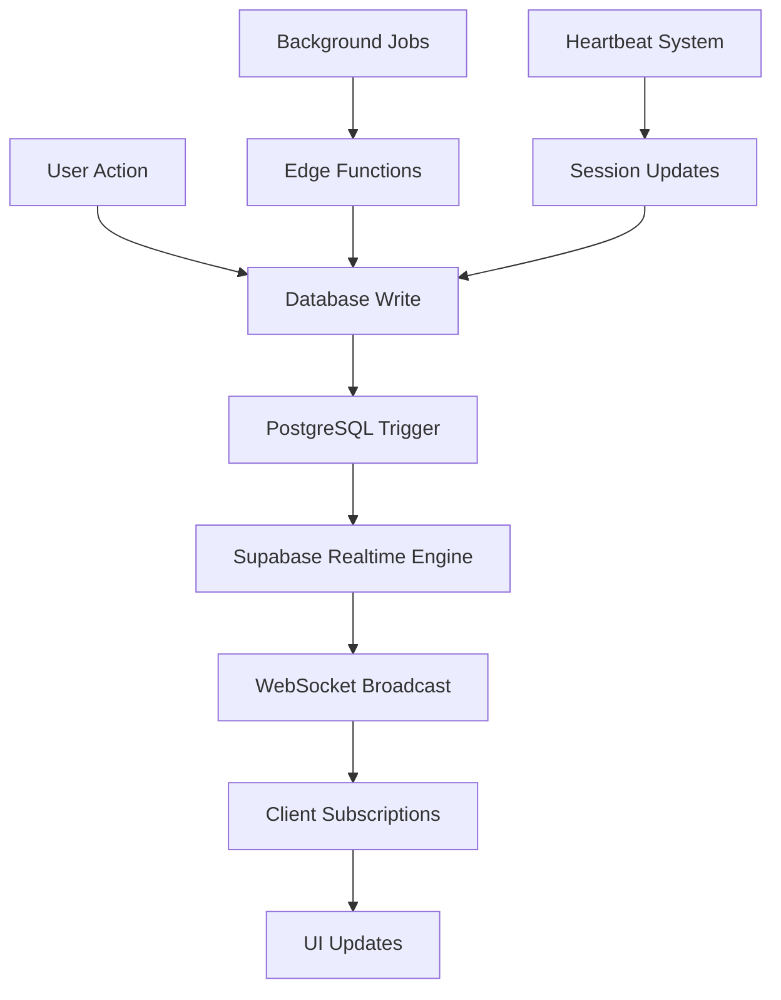
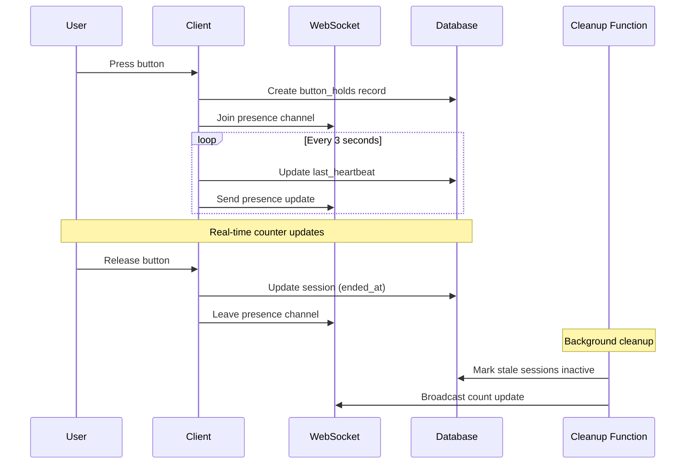
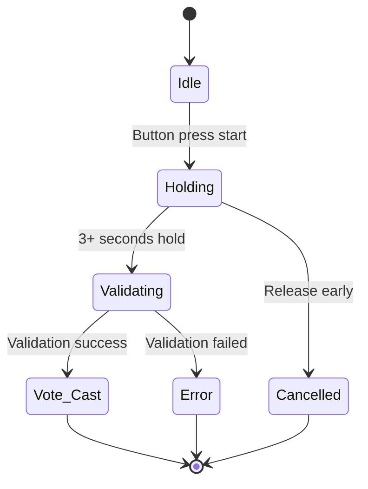
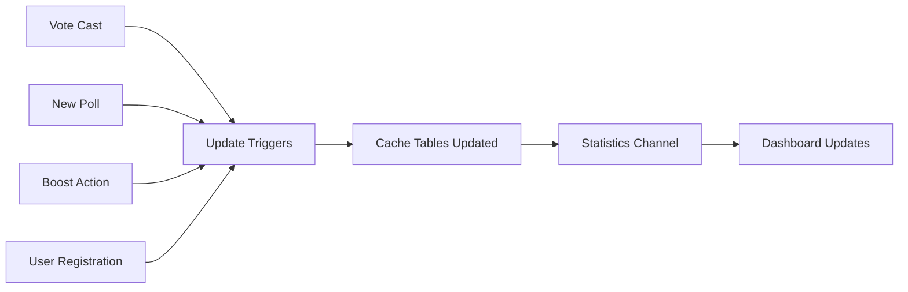

# Real-time Systems Architecture

## Overview

The application uses Supabase's real-time capabilities for live updates across multiple systems including polls, voting, button sessions, and statistics.

## Real-time Data Flow



## Button Hold Real-time System

### Session Lifecycle


### Implementation Pattern
```typescript
// Button hold real-time tracking
export const useSessionManager = () => {
  const [activeCount, setActiveCount] = useState(0);
  
  useEffect(() => {
    // Subscribe to button holds changes
    const channel = supabase
      .channel('button-sessions')
      .on('postgres_changes', {
        event: '*',
        schema: 'public',
        table: 'button_holds'
      }, () => {
        fetchActiveCount();
      })
      .subscribe();

    // Presence tracking for real-time counting
    const presenceChannel = supabase
      .channel('button-presence')
      .on('presence', { event: 'sync' }, () => {
        const state = presenceChannel.presenceState();
        setActiveCount(Object.keys(state).length);
      })
      .subscribe();

    return () => {
      supabase.removeChannel(channel);
      supabase.removeChannel(presenceChannel);
    };
  }, []);
};
```

## Poll Voting Real-time System

### Vote Hold Mechanism


### Vote Broadcasting
```typescript
// Real-time vote updates
export const usePolls = () => {
  useEffect(() => {
    const pollsChannel = supabase
      .channel('polls-changes')
      .on('postgres_changes', {
        event: '*',
        schema: 'public',
        table: 'polls'
      }, () => {
        fetchPolls(); // Refresh poll data
      })
      .on('postgres_changes', {
        event: '*',
        schema: 'public',
        table: 'user_votes'
      }, () => {
        fetchPolls(); // Update vote counts
      })
      .subscribe();

    return () => {
      supabase.removeChannel(pollsChannel);
    };
  }, []);
};
```

## Statistics Real-time Updates

### Data Aggregation Flow


### Real-time Statistics Implementation
```typescript
// Real-time statistics tracking
export const useStatistics = () => {
  const [stats, setStats] = useState(initialStats);
  
  useEffect(() => {
    // Subscribe to multiple tables for comprehensive stats
    const statsChannel = supabase
      .channel('statistics-updates')
      .on('postgres_changes', {
        event: 'INSERT',
        schema: 'public',
        table: 'user_votes'
      }, () => {
        refreshStats();
      })
      .on('postgres_changes', {
        event: 'INSERT',
        schema: 'public',
        table: 'polls'
      }, () => {
        refreshStats();
      })
      .on('postgres_changes', {
        event: 'INSERT',
        schema: 'public',
        table: 'profiles'
      }, () => {
        refreshStats();
      })
      .subscribe();

    return () => {
      supabase.removeChannel(statsChannel);
    };
  }, []);
};
```

## Heartbeat System

### Session Maintenance
```typescript
// Heartbeat mechanism for active sessions
export const useHeartbeat = (sessionId: string, isActive: boolean) => {
  useEffect(() => {
    if (!isActive || !sessionId) return;

    const interval = setInterval(async () => {
      try {
        await supabase
          .from('button_holds')
          .update({ last_heartbeat: new Date().toISOString() })
          .eq('id', sessionId);
      } catch (error) {
        console.error('Heartbeat failed:', error);
      }
    }, 3000); // Every 3 seconds

    return () => clearInterval(interval);
  }, [sessionId, isActive]);
};
```

### Cleanup Automation
```typescript
// Automated cleanup of stale sessions
export const scheduleCleanup = () => {
  setInterval(async () => {
    try {
      // Call edge function for cleanup
      await supabase.functions.invoke('cleanup-button-holds');
    } catch (error) {
      console.error('Cleanup failed:', error);
    }
  }, 30000); // Every 30 seconds
};
```

## Performance Optimizations

### Efficient Subscriptions
```typescript
// Optimized subscription patterns
const createEfficientSubscription = () => {
  // Combine related subscriptions into single channel
  const channel = supabase
    .channel('app-updates')
    .on('postgres_changes', {
      event: 'INSERT',
      schema: 'public',
      table: 'user_votes'
    }, handleVoteUpdate)
    .on('postgres_changes', {
      event: 'UPDATE',
      schema: 'public',
      table: 'polls',
      filter: 'status=eq.active'
    }, handlePollUpdate)
    .subscribe();

  return channel;
};
```

### Debounced Updates
```typescript
// Prevent excessive re-renders
const debouncedRefresh = useMemo(
  () => debounce(() => {
    fetchPolls();
  }, 500),
  [fetchPolls]
);
```

## Error Handling & Reliability

### Connection Management
```typescript
// Robust connection handling
export const useRealtimeConnection = () => {
  const [connectionStatus, setConnectionStatus] = useState('connecting');
  
  useEffect(() => {
    const channel = supabase
      .channel('connection-monitor')
      .on('system', {}, (payload) => {
        setConnectionStatus(payload.status);
      })
      .subscribe((status) => {
        setConnectionStatus(status);
        
        if (status === 'CHANNEL_ERROR') {
          // Implement reconnection logic
          setTimeout(() => {
            channel.subscribe();
          }, 5000);
        }
      });

    return () => {
      supabase.removeChannel(channel);
    };
  }, []);
  
  return connectionStatus;
};
```

### Fallback Mechanisms
```typescript
// Fallback polling when real-time fails
export const useRealtimeWithFallback = () => {
  const [connectionStatus] = useRealtimeConnection();
  
  useEffect(() => {
    if (connectionStatus === 'CHANNEL_ERROR') {
      // Fall back to polling
      const pollInterval = setInterval(() => {
        fetchPolls();
      }, 10000); // Poll every 10 seconds
      
      return () => clearInterval(pollInterval);
    }
  }, [connectionStatus]);
};
```

## Scaling Considerations

### Channel Management
- **Channel Limits**: Supabase has limits on concurrent channels
- **User Segmentation**: Consider splitting users across multiple channels
- **Geographic Distribution**: Regional channels for better performance

### Data Volume Management
```typescript
// Efficient data filtering for large datasets
const efficientPollSubscription = supabase
  .channel('polls-filtered')
  .on('postgres_changes', {
    event: '*',
    schema: 'public',
    table: 'polls',
    filter: 'status=eq.active' // Server-side filtering
  }, handleUpdate)
  .subscribe();
```

### Caching Strategy
```typescript
// Cache frequently accessed data
const useRealtimeWithCache = () => {
  const [cachedData, setCachedData] = useState({});
  const [lastUpdate, setLastUpdate] = useState(Date.now());
  
  // Only refresh if data is stale (> 30 seconds)
  const shouldRefresh = Date.now() - lastUpdate > 30000;
  
  if (shouldRefresh) {
    fetchFreshData();
  }
};
```