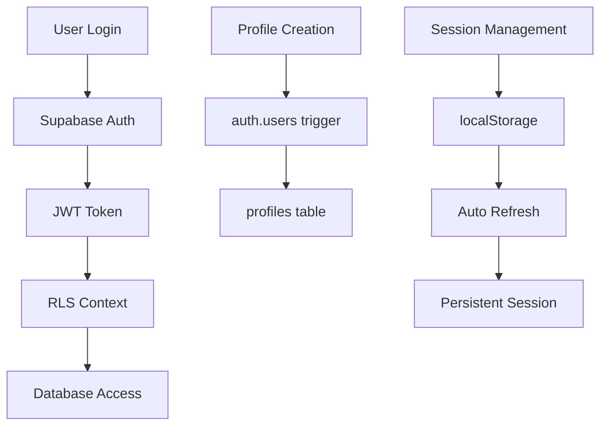

# Security Model & Implementation

## Authentication Architecture

### Supabase Auth Integration


### Row Level Security (RLS) Implementation

#### User Data Isolation
```sql
-- Example: Users can only access their own votes
CREATE POLICY "Users can create own votes" ON user_votes
FOR INSERT WITH CHECK (auth.uid() = user_id);

CREATE POLICY "Users can view all votes" ON user_votes
FOR SELECT USING (true);
```

#### Content Creator Permissions
```sql
-- Poll creators can manage their polls and options
CREATE POLICY "Poll creators can manage options" ON poll_options
FOR ALL USING (
  EXISTS (
    SELECT 1 FROM polls 
    WHERE polls.id = poll_options.poll_id 
    AND polls.created_by = auth.uid()
  )
);
```

#### Anonymous User Handling
```sql
-- Button holds allow anonymous users
CREATE POLICY "Users can manage own holds" ON button_holds
FOR ALL USING (
  (auth.uid() = user_id) OR (user_id IS NULL)
);
```

## Input Validation & Sanitization

### Frontend Validation
```typescript
// Multi-layer validation approach
export const validatePollQuestion = (question: string): string[] => {
  const errors: string[] = [];
  
  if (!question?.trim()) {
    errors.push('Question is required');
  } else if (question.length < 10) {
    errors.push('Question must be at least 10 characters');
  } else if (question.length > 200) {
    errors.push('Question cannot exceed 200 characters');
  }
  
  // XSS pattern detection
  if (containsXSSPatterns(question)) {
    errors.push('Question contains invalid content');
  }
  
  return errors;
};
```

### Backend Validation (Database Functions)
```sql
-- Server-side validation with security checks
CREATE OR REPLACE FUNCTION validate_poll_input(
  question_text text, 
  option_texts text[]
)
RETURNS boolean
LANGUAGE plpgsql
SECURITY DEFINER
SET search_path TO ''
AS $$
BEGIN
  -- Length validation
  IF question_text IS NULL OR 
     length(trim(question_text)) < 10 OR 
     length(question_text) > 200 THEN
    RAISE EXCEPTION 'Question must be between 10 and 200 characters';
  END IF;
  
  -- XSS pattern detection
  IF question_text ~* '(<script|javascript:|on\w+\s*=|<iframe|<object|<embed)' THEN
    RAISE EXCEPTION 'Invalid content detected in question';
  END IF;
  
  RETURN true;
END;
$$;
```

### Content Sanitization
```typescript
// XSS prevention utility
export const sanitizeInput = (input: string): string => {
  return input
    .replace(/</g, '&lt;')
    .replace(/>/g, '&gt;')
    .replace(/"/g, '&quot;')
    .replace(/'/g, '&#x27;')
    .replace(/\//g, '&#x2F;')
    .trim();
};
```

## Rate Limiting System

### Implementation Pattern
```typescript
export class RateLimiter {
  private attempts: Map<string, number[]> = new Map();
  
  constructor(
    private maxAttempts: number,
    private windowMs: number
  ) {}
  
  canPerform(identifier: string): boolean {
    const now = Date.now();
    const userAttempts = this.attempts.get(identifier) || [];
    
    // Remove expired attempts
    const validAttempts = userAttempts.filter(
      time => now - time < this.windowMs
    );
    
    if (validAttempts.length >= this.maxAttempts) {
      return false;
    }
    
    validAttempts.push(now);
    this.attempts.set(identifier, validAttempts);
    return true;
  }
}
```

### Database-Level Rate Limiting
```sql
-- Daily boost limits with automatic reset
CREATE TABLE daily_boost_limits (
  id uuid DEFAULT gen_random_uuid() PRIMARY KEY,
  user_id uuid NOT NULL,
  boost_date date NOT NULL DEFAULT CURRENT_DATE,
  boost_count integer NOT NULL DEFAULT 0,
  max_boosts integer NOT NULL DEFAULT 3
);
```

## Session Security

### Device Fingerprinting
```typescript
// Secure device ID generation
export const generateSecureDeviceId = (): string => {
  const canvas = document.createElement('canvas');
  const ctx = canvas.getContext('2d');
  ctx.textBaseline = 'top';
  ctx.font = '14px Arial';
  ctx.fillText('Device fingerprint', 2, 2);
  
  const canvasData = canvas.toDataURL();
  const timestamp = Date.now().toString();
  const random = crypto.getRandomValues(new Uint32Array(2)).join('');
  
  return btoa(`${canvasData}-${timestamp}-${random}`).substring(0, 32);
};
```

### Session Management
```typescript
// Secure session handling with heartbeat
export const useSessionManager = () => {
  const startSession = async () => {
    const deviceId = generateSecureDeviceId();
    const sessionData = {
      device_id: deviceId,
      user_id: user?.id || null,
      country: await getCountryFromLocation(),
      started_at: new Date().toISOString()
    };
    
    // Create session with RLS protection
    const { data, error } = await supabase
      .from('button_holds')
      .insert(sessionData)
      .select()
      .single();
  };
};
```

## Error Handling Security

### Secure Error Messages
```typescript
export const handleSecureError = (error: any, context: string): string => {
  // Log full error for debugging (server-side only)
  console.error(`Error in ${context}:`, error);
  
  // Return sanitized message to user
  if (error?.message?.includes('unique constraint')) {
    return 'This action has already been performed';
  }
  
  if (error?.message?.includes('rate limit')) {
    return 'You are performing actions too quickly. Please slow down.';
  }
  
  if (error?.code === 'PGRST116') {
    return 'Access denied';
  }
  
  // Generic fallback
  return 'An error occurred. Please try again.';
};
```

## Data Protection Measures

### Sensitive Data Handling
```typescript
// Profile data with privacy controls
interface Profile {
  id: string;
  username: string;
  email?: string; // Hidden from public API
  country?: string; // Aggregated only
  created_at: string;
}
```

### Database Security Configuration
```sql
-- Ensure all functions use secure search path
CREATE OR REPLACE FUNCTION secure_function()
RETURNS void
LANGUAGE plpgsql
SECURITY DEFINER
SET search_path TO '' -- Prevent search path injection
AS $$
BEGIN
  -- Function implementation
END;
$$;
```

## Audit Trail & Monitoring

### Security Event Logging
```typescript
// Log security-relevant events
const logSecurityEvent = async (event: string, details: any) => {
  console.log(`Security Event: ${event}`, {
    timestamp: new Date().toISOString(),
    user_id: user?.id,
    ...details
  });
};

// Usage examples
logSecurityEvent('failed_login_attempt', { email });
logSecurityEvent('rate_limit_exceeded', { operation: 'vote' });
logSecurityEvent('suspicious_input', { content: sanitizedInput });
```

### Real-time Security Monitoring
```typescript
// Monitor for suspicious patterns
const monitorSuspiciousActivity = () => {
  // Track rapid repeated actions
  // Monitor for unusual voting patterns
  // Alert on potential bot behavior
};
```

## Compliance Considerations

### GDPR Compliance Framework
- **Data Minimization**: Only collect necessary data
- **Right to Access**: Users can view their data
- **Right to Deletion**: Account deletion cascades properly
- **Data Portability**: Consider export functionality
- **Consent Management**: Clear privacy policies

### Security Best Practices Implemented
- ✅ Input validation on all user inputs
- ✅ XSS prevention through sanitization
- ✅ SQL injection prevention via parameterized queries
- ✅ Rate limiting on all user actions
- ✅ Secure session management
- ✅ Row-level security on all tables
- ✅ Secure error handling
- ✅ Regular security audits via automated tools