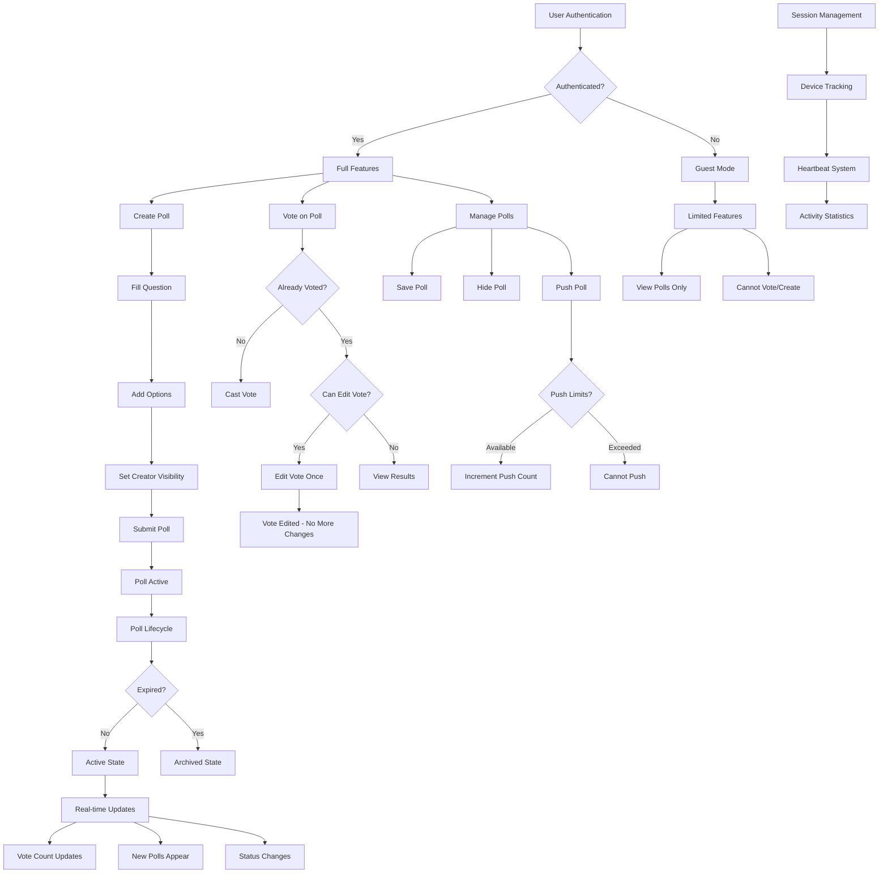
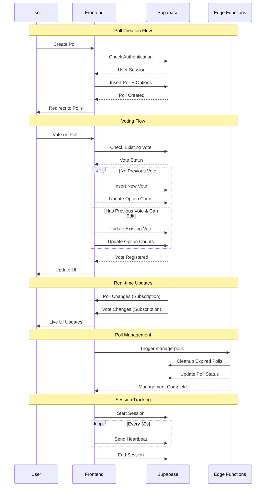
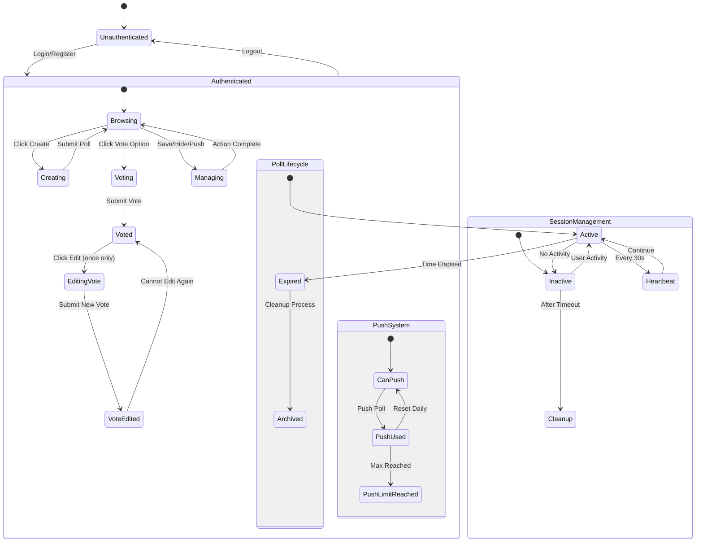

# Application Flow & Architecture

## User Flow Diagram

## API Interaction Sequence

## State Management

## Key Components & Behavior

### Authentication System
- **Guest Mode**: Read-only access to polls
- **Authenticated Mode**: Full CRUD operations
- **Session Persistence**: Local storage with auto-refresh

### Voting System
- **Single Vote**: One vote per user per poll
- **Vote Editing**: One-time edit capability after initial vote
- **Real-time Updates**: Live vote count synchronization

### Poll Management
- **Creation**: Question + multiple options with creator visibility option
- **Lifecycle**: Active (24h) → Expired → Archived
- **Push System**: User-driven promotion with daily limits

### Real-time Features
- **Supabase Subscriptions**: Live updates for polls and votes
- **Session Tracking**: Heartbeat system for activity statistics
- **Statistics**: Real-time user count and activity metrics

### Edge Functions
- **manage-polls**: Automated cleanup of expired polls
- **Triggers**: Time-based and manual poll management