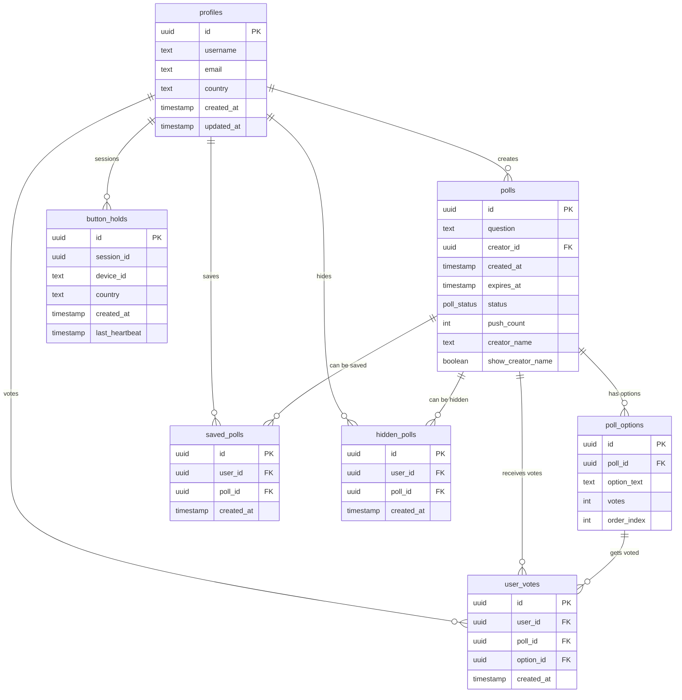

# Database Schema & Information Flow

## Entity Relationship Diagram

## Tables Description

### Core Tables

#### `profiles`
- User management table
- Stores basic user information including country for statistics
- Primary key for all user-related operations

#### `polls`
- Main polls table
- Contains poll question, creator info, timing, and push statistics
- Links to creator via `creator_id` foreign key
- Status field manages poll lifecycle (active/expired/archived)

#### `poll_options`
- Individual options for each poll
- Tracks vote count per option
- Order index for consistent display

#### `user_votes`
- Tracks user voting behavior
- One vote per user per poll (enforced by business logic)
- Links user, poll, and specific option chosen

### Management Tables

#### `saved_polls`
- User's saved/bookmarked polls
- Simple many-to-many relationship between users and polls

#### `hidden_polls`
- Polls hidden by users from their view
- Filters out unwanted content per user

#### `button_holds`
- Session tracking for statistics
- Heartbeat system for real-time activity monitoring
- Device and country tracking for analytics

## Key Business Rules

1. **One Vote Per Poll**: Users can vote once per poll, with one-time edit capability
2. **Push System**: Daily limits on poll promotion with tracking
3. **Poll Lifecycle**: Active → Expired → Archived based on time
4. **Session Management**: 30-second heartbeat system for activity tracking
5. **Real-time Updates**: Live synchronization of votes and poll changes